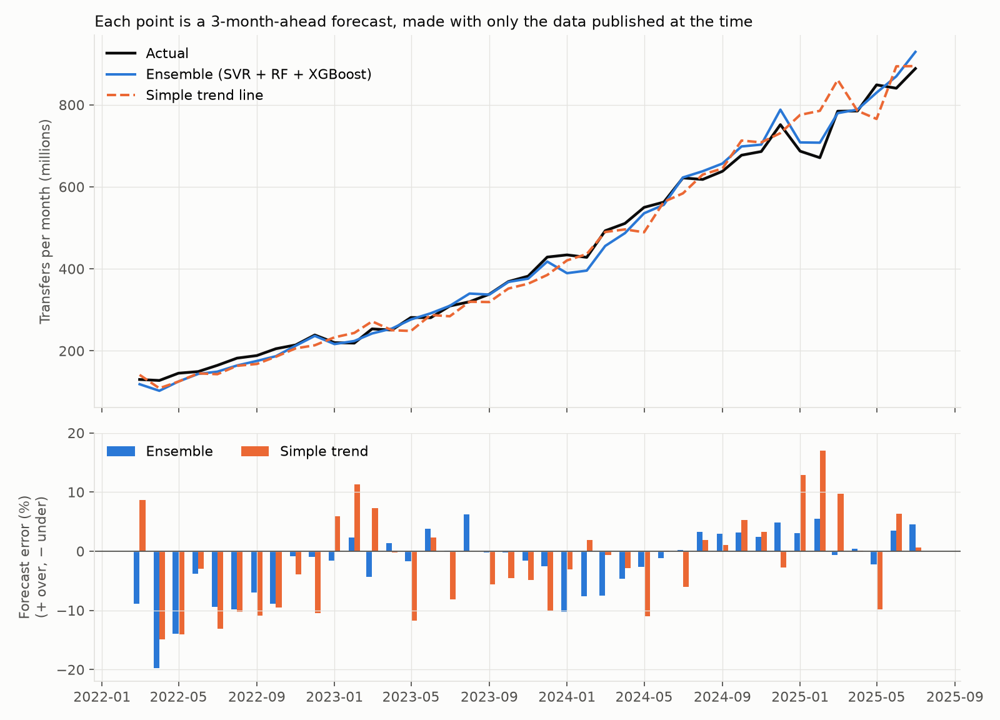
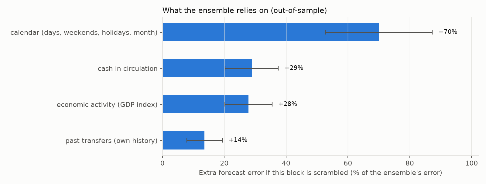
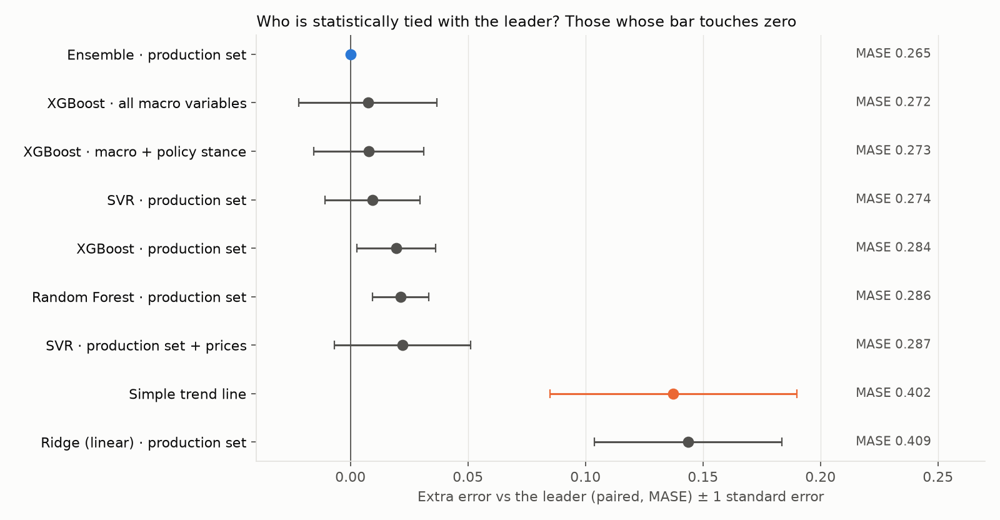

# Machine Learning Forecasting of Digital Payments in Peru (Yape & Plin)

[](https://github.com/rodrigogarcia92/ml-pagos-por-telefono/actions/workflows/ci.yml)

A machine learning project that forecasts how many phone transfers Peruvians will make in the coming months, using public data from Peru's central bank (**BCRP**). It is built end to end: public API → cloud data warehouse → tested data transformations → forecasting models → experiment tracking.

**What is forecast, and why.** Yape and Plin, Peru's mobile wallets, are reported by BCRP only since January 2024, about 30 months of data. That is too short to train and test a forecasting model reliably. Yape and Plin transfers are counted inside BCRP's **intrabank transfers** series, which goes back to 2013 (163 months). This project uses that series as a **proxy variable**: a closely related measure with much more history.

- Yape and Plin make up **73% → 88%** of all intrabank transfers (Jan 2024 → Jul 2026), **83% on average**.
- Month to month, the two series move together: **0.98 correlation** in monthly growth.

So forecasting intrabank transfers is, in practice, forecasting the Yape and Plin economy, with five times more data to learn from.

---

## At a glance

> **Business question:** How many digital transfers will be made in Peru **3 months from now**?
>
> **Result:** a machine learning ensemble with a **typical error of about 4.4%**, against **6.5%** for a simple trend line, **about a third less error**. This was measured on 41 realistic backtest forecasts (Mar 2022 – Jul 2025).
>
> **Confirmed on held-back data:** on the final 12 months (Aug 2025 – Jul 2026), tested once after the model was frozen, the ensemble's error was **2.8%** against **7.6%** for the trend line (MASE 0.213 vs 0.568).
>
> **Main drivers:** the calendar (working days, weekends, holidays), cash in circulation, and economic activity.
>
> **Status:** in production. The model is frozen and has passed its one-time final test on 12 months it had never seen (typical error 2.8% vs 7.6% for the trend line). A scheduled job publishes a new forecast every month (see [Latest forecast](#latest-forecast) and [Roadmap](#9-roadmap)).

| Aspect | Detail |
|---|---|
| **Problem type** | Time-series forecasting (regression on monthly growth) |
| **Best model** | Ensemble of SVR + Random Forest + XGBoost (equal-weight average) |
| **Validation** | Expanding-window backtesting (41 folds), then a one-time 12-month holdout: **passed** |
| **Benchmarks** | 5 naive baselines; the hardest one, a simple trend line, is the bar to beat |
| **Experiments** | ~200 tracked runs: 8 model families × 6 feature sets × 3 horizons |
| **Rigor** | Pre-registered protocol, leakage guards enforced in code, ~180 offline tests in CI |

### Tech stack

**Languages and ML**


**Data engineering and cloud**


**MLOps and quality**


**Serving (planned)**


---

## Contents
1. [Why this matters](#1-why-this-matters)
2. [Business use cases](#2-business-use-cases)
3. [Results](#3-results)
4. [Key concepts (glossary)](#4-key-concepts-glossary)
5. [How it works](#5-how-it-works)
6. [How the best model was chosen](#6-how-the-best-model-was-chosen)
7. [What did not work (and why that is useful)](#7-what-did-not-work-and-why-that-is-useful)
8. [Limitations](#8-limitations)
9. [Roadmap](#9-roadmap)
10. [Repository guide, setup and tests](#10-repository-guide-setup-and-tests)

---

## 1. Why this matters

Since 2020, Yape and Plin have changed how Peruvians pay. Paying a street vendor, splitting a bill or sending money to family is now a phone transfer. BCRP reports that monthly intrabank transfers went from about **15 million in 2013 to over 1.1 billion in mid-2026**, and the wallets drive most of that growth.

Anyone who runs, funds or depends on this payment system needs to know **how much volume is coming**: banks, payment networks, fintechs, the regulator, merchants. This project asks whether that volume can be forecast reliably from public data alone, and **how far ahead**.

## 2. Business use cases

The model forecasts **total monthly transfer volume, 3 months ahead**, with an expected error band. That is useful wherever a decision has to be made about a quarter in advance.

| Who | Decision supported | How the forecast helps |
|---|---|---|
| **Bank treasury / liquidity teams** | How much liquidity to reserve for transfer settlement | Plan reserves around the expected volume, using the forecast range (about −5% / +11% at 90%) as a buffer |
| **Payment infrastructure** (bank IT, wallet operators, clearing houses) | Server, network and processing capacity | Scale capacity before peaks (December, mid-year bonuses, holidays) instead of reacting to outages |
| **Operations and fraud teams** | Staffing for support and fraud monitoring | Fraud and support cases scale with transactions; staff ahead of high-volume months |
| **Product and marketing** (wallets, banks, fintechs) | Campaign timing and growth targets | Set realistic targets and separate a campaign's effect from normal seasonal growth |
| **Finance / FP&A** | Fee-revenue and cost budgets | Turn expected volume into expected fees and processing costs for the next quarter |
| **Regulators and policy analysts** | Monitoring of the payment system | An early benchmark: if actual volume departs sharply from the forecast, something changed (an outage, a regulation, an adoption shock) |
| **Merchants and retail analytics** | Cash vs digital payment mix | Anticipate how fast customers move from cash to phone payments |

**One important boundary:** at 5–6 months ahead the model is no better than a trend line. Use it for **quarter-ahead operational planning**, not for long-term strategy.

## 3. Results

Sections 3.1, 3.3 and 3.4 come from **backtesting** (see the glossary): the model was repeatedly asked to forecast months it had never seen, using only data that was public at the time. That gives 41 realistic forecasts, March 2022 – July 2025. Section 3.2 is the one-time final test on the last 12 months.

### 3.1 The best model vs a simple trend

| | Best model (ensemble) | Simple trend line |
|---|---|---|
| Typical error (MAPE) | **4.4%** | 6.5% |
| Median error | **3.2%** | 5.9% |
| Error in 8 of 10 months | **under 7.5%** | under 10.8% |
| Worst month | 19% | 17% |
| MASE (lower is better; 1.0 is a naive reference) | **0.265** | 0.402 |

The model is better on average, and the difference is statistically reliable: it won in **99.7%** of 5,000 resampled versions of history. It is not better every single month. It is closer to the truth in **24 of 41** months, but wins by a wide margin when it wins.



*Top: actual transfers (black, millions per month), the model's forecast (blue) and a simple trend (orange). Each point was forecast 3 months earlier with only the data available then. Bottom: percentage error for each month.*

### 3.2 The final test: 12 months the model never saw

After the model was chosen and frozen, it was tested **once** on the last 12 months of data (August 2025 – July 2026). Those months had been locked away from every decision. Which two forecasts to compare, and what would count as a pass, were written down before the test was run.

| | Best model (ensemble) | Simple trend line |
|---|---|---|
| Typical error (MAPE) | **2.8%** | 7.6% |
| MASE (lower is better) | **0.213** | 0.568 |

The ensemble passed. Compared month by month, its advantage is about three standard errors wide (MASE −0.355 ± 0.109), so it is very unlikely to be luck. Nothing was re-tuned after the test.

**Read with care:** 12 months is a small sample. The final-test error is lower than the backtest error (2.8% vs 4.4%). That is consistent with the backtest, not proof that the model improved, so the backtest figures remain the safer basis for planning.
### 3.3 What drives the forecast



*How much worse the forecast gets when each group of inputs is scrambled. A bigger bar means the model relies on it more.*

| Driver | Plain-language meaning |
|---|---|
| **Calendar** (strongest) | The number of days, weekends and holidays in a month, and the month itself. People transfer money when they get paid and when they spend (December, mid-year bonuses). |
| **Cash in circulation** | How much physical money is out there. It is published sooner than the transfer data, so it works as an early signal of spending. |
| **Economic activity** | BCRP's monthly GDP index, a slower signal of the general pace of the economy. |
| **Past transfers** | The recent trend. It matters, but less than the three above. |

**The story in one sentence:** the model starts from the recent growth trend, then adjusts it for the calendar and for what cash and activity say about spending. What it cannot see are sudden shifts in how fast people adopt digital payments (2022, early 2024).

### 3.4 Further ahead

| Forecast horizon | Typical error | Better than a trend line? |
|---|---|---|
| 3 months | 4.4% | **Yes**, clearly |
| 5 months | 7.1% | Not reliably |
| 6 months | 8.3% | Not reliably |

### Latest forecast

| | |
|---|---|
| Target month | October 2026 |
| Point forecast | **1,274 million** transfers (1,273.6) |
| 80% range | 1,227 – 1,405 million (about −4% / +10%) |
| 90% range | 1,215 – 1,419 million (about −5% / +11%) |
| Last observed month | July 2026: 1,154 million |
| Data version | 20261007T000000Z |
| Published | 7 October 2026 (pull request #3) |

The forecasts are published automatically each month as a pull request. Once it is merged, the newest one is always in [forecasts/](forecasts/), and the full list is in [forecasts/history.csv](forecasts/history.csv).

The range comes from the model's real backtest errors. It is wider on the upside because in fast-growth periods actual transfers came in above the forecast more often than below.

## 4. Key concepts (glossary)

| Term | Meaning |
|---|---|
| **Proxy variable** | A measure used in place of the one you care about because it is closely related and easier to get. Here: all intrabank transfers (163 months) in place of Yape + Plin (30 months). |
| **Forecast horizon (h)** | How far ahead the forecast looks. Because BCRP publishes payment data about **2 months late**, "h=3" means forecasting the month right after today, starting from data that is 2 months old. |
| **Publication lag** | The delay between a month ending and its data being published. Payments: 2 months; GDP index: 2; cash in circulation: 1. The model **never** uses a figure that wasn't public at the time. |
| **Baseline** | A deliberately simple forecast that any model must beat. Here the hardest baseline is the **simple trend line**: "growth continues at its historical average rate." |
| **Backtesting (cross-validation)** | Replaying history. The model is trained on data up to a date, forecasts ahead, and then the window moves forward one month. It is repeated 41 times. |
| **Holdout** | The last 12 months of data, locked away and never used to choose a model. It is used **once**, at the end, as the final exam. |
| **MAPE** | Mean absolute percentage error, the average size of the miss as a % of the actual value. 4.4% means "usually off by about 4–5%." |
| **MASE** | Error scaled against a naive reference. Below 1 beats that reference; lower is better. Used to rank models fairly. |
| **Feature** | An input to the model, for example "number of holidays in the target month." |
| **Feature set** | A named group of inputs. The production set is calendar + past transfers + cash in circulation + GDP index. |
| **SVR, Random Forest, XGBoost** | Three machine learning methods. SVR fits a smooth curve; Random Forest and XGBoost combine many decision trees. |
| **Ensemble** | The average of several models' forecasts. Averaging cancels part of each model's individual mistakes. |
| **Pre-registration** | Writing down the tests, success thresholds and decision rules **before** seeing the results, so they cannot be bent to fit the data. |
| **Statistically tied** | Two models whose difference is smaller than its uncertainty, so we cannot honestly say one is better. |

## 5. How it works

### 5.1 Pipeline

```
BCRP public API  (22 monthly series, one request per series)
      │
      ▼
data/raw/bcrp/*.json        immutable snapshots, committed to git (the "source of truth")
      │
      ▼
Google BigQuery  raw        cloud data warehouse
      │  dbt (data transformation tool, with automated data-quality tests)
      ▼
staging → marts             cleaned, de-duplicated, one row per month
      │
      ▼
data/processed/panel_*.parquet   frozen training snapshot (training never touches the cloud)
      │
      ▼
features → backtesting → models → MLflow (experiment tracking: every run, setting and score logged)
```

A scheduled GitHub Actions job runs this chain every month. BCRP publishes on no fixed day, so the job tries three times: on the 10th, 20th and 28th. If a new month has been published, it forecasts the next one and opens a pull request with the new raw data and the forecast. If not, it does nothing. If a step fails, it opens an issue. After the first month is scored, the same job checks the drift alert.

### 5.2 Data

| Group | Examples | Since |
|---|---|---|
| **Target (proxy)** | Intrabank transfers, system-wide (BCRP `PN42200EM`) | 2013 |
| **Wallet split** | Yape and Plin transfers (`PN42672EM`, `PN42673EM`) | 2024 (~30 months) |
| **Macro** | Cash in circulation, GDP index, CPI, exchange rate, policy rate, formal income, dollarization | 2010 |
| **Search interest** | Google Trends for Yape and Plin (tested, not used; see §7) | 2017 |

### 5.3 Method in five rules

1. **No look-ahead.** Each input is used only at its real publication date, and the code refuses to build a feature that breaks this.
2. **Forecast growth, not levels.** Models predict the % change from the last published month, then convert it back to a level.
3. **Beat the baseline first.** Five simple forecasts were run before any machine learning. The simple trend line was the hardest to beat.
4. **Test like it's live.** Expanding-window backtesting: train on the past, forecast forward, move one month, repeat.
5. **Decide before looking.** Thresholds and decision rules are written into [`docs/training_plan.md`](docs/training_plan.md) before each experiment. Every deviation is logged there with its reason.

### 5.4 What was tested

About 200 tracked experiment runs. The core comparison spans **8 model families** (5 naive baselines, Ridge/ElasticNet linear models, SARIMAX statistical models, SVR, Random Forest, XGBoost, the ensemble) × **6 feature sets** (calendar only, up to all macro variables) × several horizons and time windows.

## 6. How the best model was chosen

Picking "the lowest number on the leaderboard" is not enough when many models are close. The choice used four filters:

1. **Beat the baseline.** Only models clearly better than the simple trend line stay in.
2. **Paired comparison.** Every model was scored on the **same 41 forecasts**, so each candidate is compared to the leader month by month. Candidates within one standard error count as **tied**.
3. **Prefer the simpler, earlier-justified option among ties.** XGBoost with all macro variables was tied, but those variables had already been shown not to help (§7), so it was excluded.
4. **Check stability.** History was resampled 5,000 times in blocks of 6 months to see how often each model wins. The ensemble came first most often (42%), and the trend line never did.



*Extra error of each model compared with the leader. A bar that touches zero means statistically tied.*

**Decision:**
- **Production candidate:** the ensemble on the production feature set.
- **Simpler fallback:** SVR alone, statistically tied with the ensemble.
- **Final exam:** the holdout compared exactly two forecasts, the ensemble vs the trend line, under a rule fixed before running it. The ensemble passed (§3.2).

## 7. What did not work (and why that is useful)

Negative results save time and money: they show which data is not worth buying, building or maintaining.

| Idea | Result | What it means |
|---|---|---|
| **More macro variables** (prices, exchange rate, interest rate, formal income, dollarization) | No improvement; sometimes worse | Monthly transfer volume isn't driven by these short-term macro movements |
| **Google Trends** (searches for Yape and Plin) | Failed the pre-set data-quality gate: zero values before 2021 and correlation 0.195 vs the 0.20 threshold | Search interest is too sparse and noisy to forecast monthly volume |
| **Forecasting 5–6 months ahead** | Not reliably better than a trend line | Public data runs out of signal after about one quarter |
| **Linear and classical statistical models** | Not better than a trend line | The relationships are non-linear (calendar × growth regime) |

## 8. Limitations

- **A small final test.** The holdout has only 12 months. It confirmed the backtest result, but its lower error should not be read as a better model; plan with the backtest figures.
- **Forecasts tend to land low when growth speeds up.** In backtesting the actual value came in above the forecast more often than below, so the published range is skewed upward.
- **Adoption shocks.** Sudden changes in adoption speed (2022, early 2024) cause the largest misses, up to 19%. Plan with the 90% range (about −5% / +11%), which covers about 9 in 10 months.
- **A proxy, not the wallets themselves.** The model forecasts all intrabank transfers. Yape and Plin are 83% of them and move almost identically, but the remaining 17% (in-app bank transfers) is included.
- **Public data only.** A bank with its own daily data could do considerably better. This project shows what is possible from BCRP alone.
- **Volume, not value.** The model forecasts the number of transfers, not soles transferred.

## 9. Roadmap

| Feature | Status |
|---|---|
| Data pipeline: BCRP API → BigQuery → dbt, with data tests | ✅ Live |
| Experiment tracking and model comparison (MLflow) | ✅ Live |
| 3-month forecasting model, selected under a pre-registered protocol | ✅ Done |
| One-time holdout test (ensemble vs trend line) | ✅ Done: passed (MASE 0.213 vs 0.568) |
| **Monthly auto-refresh**: a scheduled GitHub Actions job pulls each new BCRP release, rebuilds the warehouse, re-scores the model and publishes the next forecast | ✅ **Live** (since October 2026) |
| **Drift alert**: flags the forecast when it misses by more than 10% two months in a row | ✅ **Live** (first check once the October 2026 actual is published) |
| Forecast API: FastAPI → Docker → Google Cloud Run | 📅 Planned |
| Transfer-learning model across the long aggregate series for a Yape/Plin split | 📅 Planned |
| Forecasting transfer **value** (soles) and wallet market share | 📅 Planned |

## 10. Repository guide, setup and tests

### Layout

```
data/raw/bcrp/           immutable API snapshots; the warehouse rebuilds from these
data/raw/google_trends/  manual Trends exports + .meta.json (tested, not used in models)
data/processed/          training snapshots (gitignored, rebuilt by snapshot.py)
docs/                    design outline, pre-registered training plan, runbook, figures
configs/                 feature sets and experiment sweeps (YAML)
pagos_dbt/               dbt project (models + data-quality tests)
scripts/                 MLflow launcher, Trends data gate, helpers
src/data_collection/     BCRP client, parsers, BigQuery and Trends loaders
src/model_training/      snapshot → features → backtest folds → models → metrics → MLflow
tests/                   offline tests on a synthetic panel (no network, no credentials)
```

### Setup

There are two virtual environments, never active at once: `.venv` for ETL and modeling, and `.venv-dbt` for dbt, because their dependency pins collide.

```powershell
python -m venv .venv
.venv\Scripts\activate
pip install -r requirements-dev.txt
copy .env.example .env
gcloud auth application-default login
```

The full cold-start procedure is in [`docs/RUNBOOK.md`](docs/RUNBOOK.md).

### Run the pipeline

```powershell
python -m src.data_collection.fetch_target_series      # BCRP API -> data/raw/bcrp/
python -m src.data_collection.load_to_bigquery         # -> BigQuery raw
# dbt build  (in .venv-dbt)
python -m src.model_training.snapshot                  # warehouse -> parquet snapshot
python -m src.model_training.sweep --config configs/sweeps/s5_trends_ens.yaml
python -m src.model_training.report --target t3 --horizon 3
python scripts/make_readme_figures.py                  # regenerate the charts in docs/figures/
```

### Tests

```powershell
pytest
```

About 180 offline tests. They cover leakage guards (including a shuffled-target "canary" that must fail to learn), publication-lag enforcement, backtest fold arithmetic, and ensemble reproducibility. They need no cloud access, which is why CI runs them without secrets.

### Design notes

- **One BCRP code per API call.** Batched responses come back out of order and labeled only by long names, so the code-to-values mapping cannot be recovered.
- **Training is local by design.** The dataset is a few hundred kilobytes; the cloud is used where it adds value (warehouse, scheduled refresh, serving).
- **No credentials in the repository.** Authentication uses Application Default Credentials.

### Documentation

- [`docs/project_outline.md`](docs/project_outline.md): design, architecture, decisions
- [`docs/training_plan.md`](docs/training_plan.md): the pre-registered modeling protocol and deviations log
- [`docs/data_sources.md`](docs/data_sources.md): data sources and warehouse decisions

## Acknowledgements

**Author:** Rodrigo García Sánchez: problem framing, methodology, modeling decisions and final judgment.

**AI assistance:** this project was developed with [Claude](https://www.anthropic.com/claude) (Anthropic) as an AI assistant, used for code implementation (via Claude Code), code and method review, analysis support and documentation drafting. Every change was reviewed and accepted by the author.

---

*Portfolio project by Rodrigo García Sánchez. Uses public BCRP data; not affiliated with BCRP, BCP/Yape, Plin or any bank. Forecasts are for illustration and are not financial advice.*
